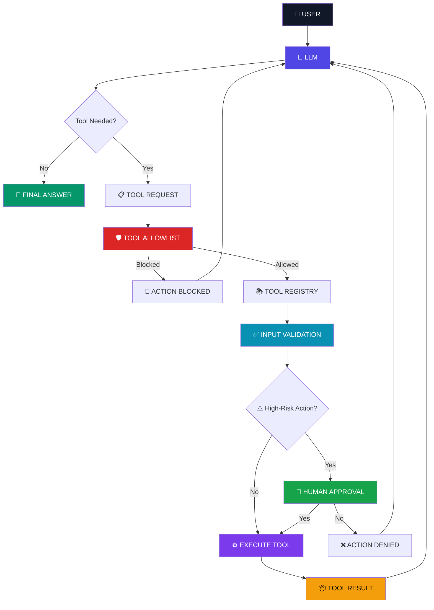
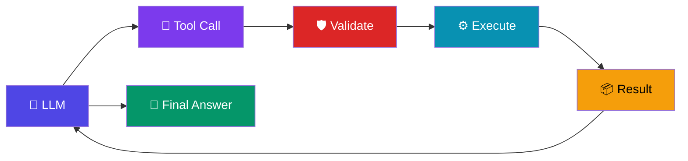

# 🤖 Controlled AI Agent

> **An AI agent that can think, choose tools, execute actions, loop when necessary  and stop when it reaches a safety boundary.**


---

## 🧠 What Is This?

This project is a **controlled AI agent built from scratch with Python and Ollama**, without using LangChain, LangGraph, CrewAI, AutoGen, or another agent framework.

The agent can:

* 🧠 Decide which tool it needs
* 🔧 Call registered Python tools
* 🔄 Execute multiple tool calls in an agent loop
* 🛡️ Validate tool access
* 🚦 Enforce a tool allowlist
* 👤 Request human approval for high-risk actions
* 🚫 Block unauthorized tools
* ⏱️ Stop after a maximum number of iterations
* 📦 Feed tool results back into the LLM
* 💬 Generate a final natural-language response

The goal is simple:

> **Give an LLM enough autonomy to be useful — without giving it unlimited control.**

---

# ⚡ The Core Idea

A normal LLM conversation looks like:

```text
USER
  ↓
LLM
  ↓
ANSWER
```

A tool-using system becomes:

```text
USER
  ↓
LLM
  ↓
TOOL REQUEST
  ↓
APPLICATION
  ↓
TOOL
  ↓
RESULT
  ↓
LLM
  ↓
ANSWER
```

An agent introduces a loop:

```text
USER
  ↓
LLM
  ↓
TOOL
  ↓
RESULT
  ↓
LLM
  ↓
ANOTHER TOOL?
  ├── YES → TOOL → RESULT → LLM
  │
  └── NO → FINAL ANSWER
```

And a **controlled agent** adds safety boundaries around that loop.

---

# 🏗️ Architecture



---

# 🔄 Agent Loop

The agent continuously follows this decision cycle:



The important difference is that the LLM can decide:

> **"I need another tool before I can answer."**

That is what creates the agent loop.

---

# 🛡️ Safety Architecture

The LLM is **not trusted to directly modify the system**.

Instead:

```text
                 LLM
                  │
                  ▼
            Tool Request
                  │
                  ▼
          ┌───────────────┐
          │  ALLOWLIST    │
          └───────┬───────┘
                  │
                  ▼
          ┌───────────────┐
          │   VALIDATION  │
          └───────┬───────┘
                  │
                  ▼
         ┌─────────────────┐
         │ PERMISSION CHECK│
         └────────┬────────┘
                  │
        ┌─────────┴─────────┐
        ▼                   ▼
      SAFE               HIGH-RISK
        │                   │
        │             HUMAN APPROVAL
        │                   │
        │              ┌────┴────┐
        │             YES        NO
        │              │          │
        └───────┬──────┘          ▼
                ▼               DENIED
             EXECUTE
                │
                ▼
           TOOL RESULT
```

This creates a critical separation:

> **The LLM decides what it wants to do.
> The application decides whether it is allowed to do it.**

---

# 🔧 Available Tools

The current implementation contains three core tools.

### 📦 `get_order_status()`

Retrieves order information.

```python
get_order_status(order_id)
```

Example:

```text
ORD-1002
     ↓
status: shipped
delivery: 2026-09-23
```

---

### 👤 `get_customer_details()`

Retrieves customer information.

```python
get_customer_details(customer_id)
```

Example:

```text
C101
 ↓
Rahul Sharma
rahul@example.com
```

---

### 🎫 `create_support_ticket()`

Creates a support ticket after validating the customer and issue.

```python
create_support_ticket(
    customer_id,
    issue
)
```

Example:

```text
Customer: C101
Issue: Order delayed

        ↓

TICKET-1001
Status: open
```

---

# 🧩 Tool Registry

Instead of creating a large chain of `if/elif` statements:

```python
if tool_name == "get_order_status":
    ...

elif tool_name == "get_customer_details":
    ...

elif tool_name == "create_support_ticket":
    ...
```

The application uses a registry:

```python
tool_registry = {
    "get_order_status": get_order_status,
    "get_customer_details": get_customer_details,
    "create_support_ticket": create_support_ticket
}
```

The agent can then dynamically find the requested function:

```python
tool_function = tool_registry.get(tool_name)
```

This makes adding new tools much cleaner.

---

# 🚦 Tool Allowlist

The agent does not automatically get permission to execute every function.

Only explicitly approved tools are allowed:

```python
allowed_tools = {
    "get_order_status",
    "get_customer_details",
    "create_support_ticket"
}
```

If the model requests something outside the allowlist:

```text
LLM
 ↓
delete_customer
 ↓
ALLOWLIST
 ↓
❌ BLOCKED
```

The LLM cannot bypass this application-level restriction.

---

# 👤 Human-in-the-Loop

Not every action should be fully autonomous.

The project demonstrates a simple approval boundary for high-risk actions.

Example:

```text
AI wants to execute:

delete_customer
customer_id = C101

Do you approve?

yes / no
```

### If approved:

```text
Human
  ↓
YES
  ↓
Tool executes
  ↓
Result
  ↓
LLM
```

### If rejected:

```text
Human
  ↓
NO
  ↓
ACTION DENIED
  ↓
LLM
```

This creates a practical **human-in-the-loop** safety mechanism.

---

# ⏱️ Maximum Iteration Protection

Agents can potentially keep calling tools repeatedly.

To prevent uncontrolled loops:

```python
MAX_STEPS = 5
```

The agent loop is bounded:

```text
STEP 1
 ↓
STEP 2
 ↓
STEP 3
 ↓
STEP 4
 ↓
STEP 5
 ↓
STOP
```

If the maximum number of steps is reached:

```text
=== AGENT STOPPED ===

The agent reached the maximum limit.
```

This prevents a runaway tool-calling loop.

---

# 🧪 Example: Multi-Step Agent

User:

> "My order ORD-1002 is delayed. Check the order and create a support ticket for customer C101."

The agent can reason through multiple actions:

```text
USER
 │
 ▼
LLM
 │
 ├── get_order_status()
 │
 ▼
Order Result
 │
 ▼
LLM
 │
 ├── create_support_ticket()
 │
 ▼
Ticket Result
 │
 ▼
LLM
 │
 ▼
FINAL RESPONSE
```

Example result:

```text
Order ORD-1002 is shipped.

A support ticket has also been created:

Ticket ID: TICKET-1001
Customer: C101
Status: open
```

The important part is that the application controls every tool execution.

---

# ⚠️ Failure Handling

The agent is deliberately tested against failure cases.

### Unknown order

```text
ORD-9999
     ↓
ORDER_NOT_FOUND
```

### Missing customer ID

```text
create_support_ticket("")
     ↓
CUSTOMER_ID_REQUIRED
```

### Unknown customer

```text
C999
     ↓
CUSTOMER_NOT_FOUND
```

### Unauthorized tool

```text
delete_customer
     ↓
TOOL_NOT_ALLOWED
```

### Human rejection

```text
High-risk action
     ↓
Human says NO
     ↓
ACTION_DENIED
```

### Excessive agent steps

```text
STEP 1
STEP 2
STEP 3
STEP 4
STEP 5
     ↓
STOP
```

---

# 🧠 Agent vs Workflow

One of the most important design decisions in AI automation is knowing when **not** to use an agent.

### Deterministic Workflow

Use a workflow when the steps are known beforehand.

```text
Lead
 ↓
Validate
 ↓
Score
 ↓
CRM
 ↓
Email
```

The application controls the path.

---

### Agent

Use an agent when the system needs to decide what information or action is required next.

```text
Customer
 ↓
LLM
 ↓
What do I need?
 ├── Search customer
 ├── Check order
 ├── Create ticket
 └── Escalate
```

The LLM has limited decision-making authority.

---

## 💡 Simple Rule

> **If you know the steps → use a workflow.**

> **If the system must decide the next step → consider an agent.**

> **If the action is risky → add human approval.**

---

# 🧰 Tech Stack

| Technology          | Purpose                        |
| ------------------- | ------------------------------ |
| 🐍 Python           | Application and tool execution |
| 🦙 Ollama           | Local LLM runtime              |
| 🧠 Llama 3.2 3B     | Local language model           |
| 🔧 Python Functions | Agent tools                    |
| 📚 Tool Registry    | Dynamic tool selection         |
| 🛡️ Allowlist       | Tool access control            |
| 👤 Human Approval   | High-risk action control       |
| 🔄 Agent Loop       | Multi-step decision cycle      |
| 🗃️ Mock Database   | Simple local data layer        |

---

# 📁 Project Structure

```text
controlled-ai-agent/
│
├── main.py
│
├── README.md
│
└── .gitignore
```

The implementation intentionally stays small.

The goal is to understand the underlying mechanism before introducing an agent framework.

---

# 🚀 Getting Started

## 1. Clone the repository

```bash
git clone https://github.com/armaankhantech/controlled-ai-agent.git
```

```bash
cd controlled-ai-agent
```

## 2. Create a virtual environment

### Windows

```powershell
python -m venv .venv
```

Activate it:

```powershell
.venv\Scripts\Activate.ps1
```

---

## 3. Install Ollama

Install Ollama and make sure it is running.

Then pull the model:

```bash
ollama pull llama3.2:3b
```

Verify:

```bash
ollama list
```

---

## 4. Install Python dependency

```bash
pip install ollama
```

---

## 5. Run the agent

```bash
python main.py
```

---

# 🎬 Example Execution

```text
=== AGENT STEP 1 ===

=== LLM RESPONSE ===

Tool:
get_order_status

Arguments:
{
    "order_id": "ORD-1002"
}

=== TOOL RESULT ===

{
    "order_id": "ORD-1002",
    "status": "shipped",
    "delivery": "2026-09-23"
}

=== AGENT STEP 2 ===

=== LLM RESPONSE ===

The current status of order ORD-1002 is "shipped".

=== FINAL AI ANSWER ===

The current status of order ORD-1002 is "shipped".
```

---

# 🔐 Design Principles

This project follows several important principles for building controlled AI systems.

### 1. LLMs should not directly control your backend

The LLM produces a request.

Your application executes it.

---

### 2. Tool arguments are untrusted input

Always validate them.

```text
LLM
 ↓
Arguments
 ↓
Validation
 ↓
Execution
```

---

### 3. Tool access should be explicit

Use an allowlist instead of allowing arbitrary functions.

---

### 4. High-impact actions need stronger controls

Examples:

```text
Read data
    ↓
Low risk

Create ticket
    ↓
Moderate risk

Delete customer
    ↓
High risk
    ↓
Human approval
```

---

### 5. Agents need boundaries

Maximum steps prevent uncontrolled loops.

---

# 📈 What This Project Demonstrates

This project demonstrates the fundamentals behind modern AI agents:

* ✅ Tool calling
* ✅ Structured tool arguments
* ✅ Tool registries
* ✅ Agent loops
* ✅ Multi-step tool execution
* ✅ Tool result feedback
* ✅ Input validation
* ✅ Tool allowlisting
* ✅ Permission boundaries
* ✅ Human-in-the-loop approval
* ✅ Failure handling
* ✅ Maximum iteration limits
* ✅ LLM/application separation

---

# 🧠 Key Engineering Lesson

The most important lesson from this project is:

> **An AI agent should not be given unlimited authority simply because it can make decisions.**

A robust architecture separates:

```text
LLM
 │
 │ decides
 ▼
Application
 │
 │ validates
 ▼
Permission Layer
 │
 │ approves
 ▼
Tool
 │
 │ executes
 ▼
Result
 │
 ▼
LLM
```

The LLM provides **reasoning and decision-making**.

The application provides **control and enforcement**.

---

# 🔮 Future Improvements

Possible future extensions include:

* [ ] Persistent database
* [ ] Authentication
* [ ] Role-based permissions
* [ ] Structured argument schemas
* [ ] Better validation
* [ ] Tool execution logging
* [ ] Observability
* [ ] Retry policies
* [ ] Rate limiting
* [ ] API-based tools
* [ ] Production database
* [ ] Automated evaluation
* [ ] Human approval dashboard
* [ ] Web interface
* [ ] Deployment

---

# 🚫 Why No Agent Framework?

This project intentionally avoids:

```text
LangChain
LangGraph
CrewAI
AutoGen
```

The purpose is to understand the mechanism first.

Before using an abstraction like:

```python
Agent(...)
```

it is useful to understand what actually happens underneath:

```text
LLM
 ↓
Tool selection
 ↓
Validation
 ↓
Execution
 ↓
Tool result
 ↓
LLM
 ↓
Loop
```

Once that mechanism is understood, frameworks become abstractions rather than magic.

---

# 🌟 Why This Matters

Modern AI systems are moving beyond:

> "Ask an LLM a question."

They are moving toward:

> **"Give an AI system controlled access to tools and let it take useful actions."**

But autonomy without boundaries creates risk.

The engineering challenge is therefore not just:

**"How do I make an agent?"**

It is:

**"How do I make an agent that can act while remaining controlled?"**

---

# 👨‍💻 Author

### Armaan Khan

**B.Sc. Computer Science — ASM CSIT, 2026**

AI Automation • Tool Calling • AI Agents • Workflow Automation • Backend Systems

[](https://www.linkedin.com/in/armaankhan-tech/)
[](https://github.com/armaankhantech)
[](https://x.com/armaankhantech)

---

## ⭐ If You Found This Useful

If this project helped you understand how controlled AI agents work:

⭐ Star the repository

🍴 Fork it

🧠 Experiment with your own tools

💬 Share what you build

---

> **Build agents. Understand the mechanism. Add guardrails. Then scale.**
