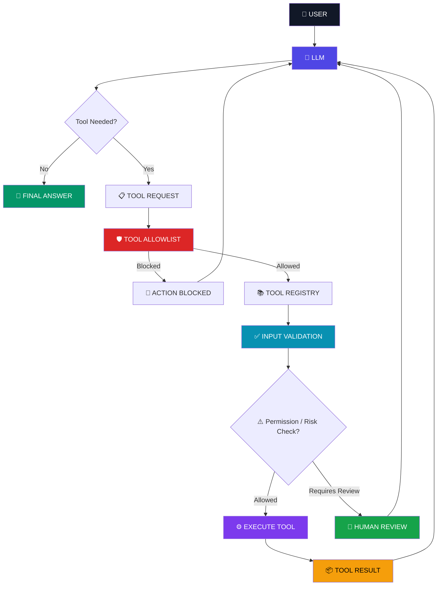
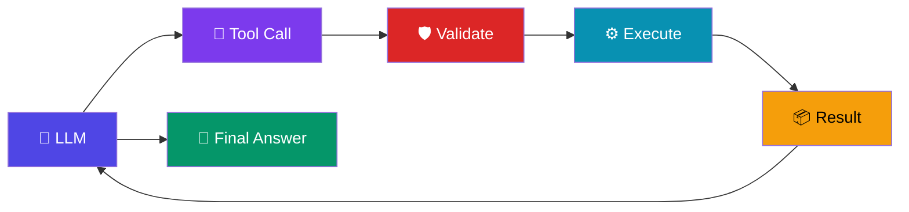

# 🤖 Controlled AI Agent

> **An AI agent that can think, choose tools, execute actions, handle failures, retry safely, and stop when it reaches a safety boundary.**


---

## 🧠 What Is This?

This project is a **controlled AI agent built from scratch with Python and Ollama**, without using LangChain, LangGraph, CrewAI, AutoGen, or another agent framework.

The goal is to understand what actually happens underneath an AI agent framework.

The agent can:

* 🧠 Decide which tool it needs
* 🔧 Call registered Python tools
* 🔄 Execute multiple tool calls in an agent loop
* 📦 Feed tool results back into the LLM
* 🛡️ Validate tool arguments
* 🚦 Enforce a tool allowlist
* 🔁 Retry transient failures
* ⏱️ Handle tool timeouts
* 🔐 Prevent duplicate actions with idempotency
* 🚫 Handle permanent failures safely
* 🤖 Handle LLM service failures
* 🛑 Stop after a maximum number of agent steps
* 👤 Escalate failed actions for human review
* 💬 Generate a final natural-language response

The core idea is:

> **Give an LLM enough autonomy to be useful — without giving it unlimited control.**

---

# ⚡ The Core Idea

A normal LLM conversation looks like:

```text
USER
  ↓
LLM
  ↓
ANSWER
```

A tool-using system becomes:

```text
USER
  ↓
LLM
  ↓
TOOL REQUEST
  ↓
APPLICATION
  ↓
TOOL
  ↓
RESULT
  ↓
LLM
  ↓
ANSWER
```

An agent introduces a loop:

```text
USER
  ↓
LLM
  ↓
TOOL
  ↓
RESULT
  ↓
LLM
  ↓
ANOTHER TOOL?
  ├── YES → TOOL → RESULT → LLM
  │
  └── NO → FINAL ANSWER
```

A controlled agent adds reliability and safety boundaries around that loop.

---

# 🏗️ Architecture



---

# 🔄 Agent Loop

The agent continuously follows this decision cycle:



The important difference is that the LLM can decide:

> **"I need another tool before I can answer."**

That is what creates the agent loop.

But the LLM does **not** directly execute Python functions.

The application controls execution.

---

# 🛡️ Safety Architecture

The LLM is **not trusted to directly control the backend**.

Instead:

```text
                 LLM
                  │
                  ▼
            Tool Request
                  │
                  ▼
          ┌───────────────┐
          │   ALLOWLIST   │
          └───────┬───────┘
                  │
                  ▼
          ┌───────────────┐
          │   VALIDATION  │
          └───────┬───────┘
                  │
                  ▼
          ┌─────────────────┐
          │ PERMISSION CHECK│
          └────────┬────────┘
                   │
             ┌─────┴─────┐
             ▼           ▼
           ALLOW       REVIEW
             │           │
             │      HUMAN REVIEW
             │           │
             │      ┌────┴────┐
             │      ▼         ▼
             │    APPROVE    REJECT
             │      │         │
             └──┬───┘         ▼
                ▼           FALLBACK
             EXECUTE
                │
                ▼
           TOOL RESULT
                │
                ▼
               LLM
```

This creates a critical separation:

> **The LLM decides what it wants to do.**
>
> **The application decides whether it is allowed to do it.**

---

# 🔧 Available Tools

The project uses registered Python functions as tools.

## 📦 `get_order_status()`

Retrieves order information.

```python
get_order_status(order_id)
```

Example:

```text
ORD-1002
    ↓
status: shipped
delivery: 2026-09-23
```

---

## 👤 `get_customer_details()`

Retrieves customer information.

```python
get_customer_details(customer_id)
```

Example:

```text
C101
  ↓
Customer information
```

---

## 🎫 `create_support_ticket()`

Creates a support ticket after validating the required arguments.

```python
create_support_ticket(
    customer_id,
    issue
)
```

Example:

```text
Customer: C101
Issue: Order delayed
        ↓
TICKET-1001
Status: open
```

---

# 🧩 Tool Registry

Instead of creating a large chain of `if/elif` statements:

```python
if tool_name == "get_order_status":
    ...

elif tool_name == "get_customer_details":
    ...

elif tool_name == "create_support_ticket":
    ...
```

The application uses a tool registry:

```python
tool_registry = {
    "get_order_status": get_order_status,
    "get_customer_details": get_customer_details,
    "create_support_ticket": create_support_ticket
}
```

The agent can then dynamically find the requested function:

```python
tool_function = tool_registry.get(tool_name)
```

This makes adding and managing tools cleaner.

---

# 🚦 Tool Allowlist

The agent does not automatically get permission to execute every function.

Only explicitly approved tools can be called.

```python
allowed_tools = {
    "get_order_status",
    "get_customer_details",
    "create_support_ticket"
}
```

If the model requests an unauthorized tool:

```text
LLM
 ↓
delete_customer
 ↓
ALLOWLIST
 ↓
❌ BLOCKED
```

The LLM cannot bypass this application-level restriction.

---

# 👤 Human Review / Fallback

Automation should not assume that every failure can be solved automatically.

When a tool fails in a way that cannot safely be recovered, the system can return a structured human-review response.

Example:

```text
Tool execution fails
        ↓
Fallback handler
        ↓
TOOL_FAILED
        ↓
human_review_required
```

Example result:

```python
{
    "error": "TOOL_FAILED",
    "status": "human_review_required",
    "tool": "create_support_ticket",
    "message": "The requested action could not be completed automatically. "
               "The failure has been recorded for human review."
}
```

This prevents the agent from pretending that an action succeeded when it did not.

---

# ⏱️ Maximum Step Protection

Agents can potentially continue calling tools indefinitely.

To prevent runaway loops, the agent has a maximum step limit.

The current implementation uses:

```python
MAX_STEPS = 3
```

The agent therefore follows:

```text
STEP 1
  ↓
STEP 2
  ↓
STEP 3
  ↓
STOP
```

When the limit is reached:

```text
MAX_STEPS_REACHED
```

The system stops safely instead of allowing an uncontrolled agent loop.

---

# 🔐 Reliability Layer

The project does more than demonstrate successful tool calling.

It also tests what happens when things go wrong.

The reliability layer covers:

```text
LLM
 │
 ▼
Tool Selection
 │
 ▼
Argument Validation
 │
 ▼
Tool Execution
 │
 ├── Success
 │
 ├── Validation Failure
 │
 ├── Permanent Failure
 │
 ├── Timeout
 │
 ├── Transient Failure
 │
 ├── Duplicate Request
 │
 └── External Failure
       │
       ▼
   Retry / Fallback
       │
       ▼
 Human Review
```

---

# 🧪 Day 55 — Reliability Test Suite

The project includes **8 reliability tests**.

```text
============================================================
DAY 55 — RELIABILITY TEST SUITE
============================================================
```

## Test 1 — Invalid Argument

Tests whether required tool arguments are validated.

Example:

```text
create_support_ticket()
        ↓
customer_id missing
        ↓
VALIDATION ERROR
```

Result:

```text
customer_id is required.
```

The system correctly prevents invalid tool execution.

---

## Test 2 — Permanent Failure

Tests an order that does not exist.

```text
ORD-999999
      ↓
ORDER NOT FOUND
      ↓
PERMANENT ERROR
```

Result:

```text
Order 'ORD-999999' does not exist.
```

The system does not retry an error that cannot be fixed through retrying.

---

## Test 3 — Tool Timeout

Simulates a tool that takes too long.

The system attempts the operation repeatedly:

```text
Attempt 1
   ↓
Retry after 1 second

Attempt 2
   ↓
Retry after 2 seconds

Attempt 3
   ↓
Retry after 4 seconds

Attempt 4
   ↓
Retry limit reached
```

Result:

```text
TIMEOUT ERROR CAUGHT:
Tool 'simulate_timeout' exceeded 5 seconds.
```

This demonstrates bounded timeout handling.

---

## Test 4 — Transient Failure

Simulates a temporary external service failure.

```text
Attempt 1
   ↓
Temporary failure
   ↓
Retry

Attempt 2
   ↓
Temporary failure
   ↓
Retry

Attempt 3
   ↓
SUCCESS
```

Result:

```python
{
    "status": "success",
    "message": "Temporary failure recovered."
}
```

This demonstrates retry behavior for recoverable failures.

---

## Test 5 — Idempotency

Tests whether the same request can accidentally create duplicate actions.

The same support-ticket request is submitted twice.

```text
FIRST REQUEST
      ↓
TICKET-1002 CREATED

SECOND IDENTICAL REQUEST
      ↓
DUPLICATE DETECTED
      ↓
RETURN EXISTING RESULT
```

Both requests return:

```text
TICKET-1002
```

Instead of creating another ticket.

This is important for real-world automation where network retries or duplicate requests can happen.

---

## Test 6 — LLM Failure

Simulates the LLM service becoming unavailable.

```text
LLM REQUEST
    ↓
SERVICE UNAVAILABLE
    ↓
LLM FAILURE HANDLER
    ↓
HUMAN REVIEW
```

Result:

```python
{
    "error": "LLM_UNAVAILABLE",
    "status": "human_review_required",
    "message": "The AI service is temporarily unavailable. "
               "The request should be reviewed or retried later."
}
```

The system fails safely instead of pretending the AI completed the request.

---

## Test 7 — Maximum Steps

Tests protection against an agent that never reaches a final answer.

```text
STEP 1
  ↓
STEP 2
  ↓
STEP 3
  ↓
MAX_STEPS_REACHED
  ↓
STOP
```

Result:

```text
Agent stopped safely because the maximum step limit was reached.
```

This prevents uncontrolled agent loops.

---

## Test 8 — Fallback / Human Review

Simulates an external tool failure.

```text
create_support_ticket
        ↓
External service failure
        ↓
Fallback handler
        ↓
human_review_required
```

Result:

```python
{
    "error": "TOOL_FAILED",
    "status": "human_review_required",
    "tool": "create_support_ticket",
    "message": "The requested action could not be completed automatically. "
               "The failure has been recorded for human review."
}
```

The system does not claim that the operation succeeded.

---

# ✅ Day 55 Test Result

All eight reliability tests completed successfully:

```text
TEST 1 — INVALID ARGUMENT       ✅
TEST 2 — ORDER NOT FOUND        ✅
TEST 3 — TOOL TIMEOUT           ✅
TEST 4 — TRANSIENT FAILURE      ✅
TEST 5 — IDEMPOTENCY            ✅
TEST 6 — LLM FAILURE            ✅
TEST 7 — MAX STEPS              ✅
TEST 8 — HUMAN REVIEW FALLBACK  ✅
```

Final output:

```text
============================================================
ALL DAY 55 RELIABILITY TESTS COMPLETED
============================================================
```

---

# 🧪 Example: Multi-Step Agent

User:

> "My order ORD-1002 is delayed. Check the order and create a support ticket for customer C101."

The LLM can request multiple tools:

```text
USER
 │
 ▼
LLM
 │
 ├── create_support_ticket()
 │
 ▼
Ticket Result
 │
 ├── get_order_status()
 │
 ▼
Order Result
 │
 ▼
LLM
 │
 ▼
FINAL RESPONSE
```

Example result:

```text
Thank you for reaching out about your delayed order.

Order:
ORD-1002

Status:
shipped

Delivery:
2026-09-23

Support Ticket:
TICKET-1001

Ticket Status:
open
```

The important part is that every tool execution passes through the application.

---

# ⚠️ Failure Handling Strategy

Different failures should be handled differently.

| Failure               | Example                   | Handling               |
| --------------------- | ------------------------- | ---------------------- |
| Validation            | Missing `customer_id`     | Stop immediately       |
| Permanent             | Order does not exist      | Stop, do not retry     |
| Timeout               | Tool takes too long       | Retry within limit     |
| Transient             | Temporary service failure | Retry                  |
| Duplicate             | Same request repeated     | Idempotency protection |
| LLM failure           | LLM unavailable           | Safe fallback          |
| Max steps             | Agent keeps looping       | Stop safely            |
| External tool failure | Tool service unavailable  | Human review           |

This distinction is important.

> **Not every failure should be retried.**

Retrying a permanent failure wastes resources.

Retrying a transient failure can recover the operation.

---

# 🧠 Agent vs Workflow

One of the most important decisions in AI automation is knowing when **not** to use an agent.

## Deterministic Workflow

Use a workflow when the steps are known beforehand.

```text
Lead
 ↓
Validate
 ↓
Score
 ↓
CRM
 ↓
Email
```

The application controls the path.

---

## Agent

Use an agent when the system needs to decide what information or action is required next.

```text
Customer
   ↓
LLM
   ↓
What do I need?
   ├── Search customer
   ├── Check order
   ├── Create ticket
   └── Escalate
```

The LLM has limited decision-making authority.

---

## 💡 Simple Rule

> **If you know the steps → use a workflow.**

> **If the system must decide the next step → consider an agent.**

> **If the action is risky or fails unexpectedly → add appropriate controls and human review.**

---

# 🧰 Tech Stack

| Technology          | Purpose                         |
| ------------------- | ------------------------------- |
| 🐍 Python           | Application and tool execution  |
| 🦙 Ollama           | Local LLM runtime               |
| 🧠 Llama 3.2 3B     | Local language model            |
| 🔧 Python Functions | Agent tools                     |
| 📚 Tool Registry    | Dynamic tool selection          |
| 🛡️ Allowlist       | Tool access control             |
| 🔄 Agent Loop       | Multi-step decision cycle       |
| ✅ Validation        | Input protection                |
| 🔁 Retry Logic      | Transient failure recovery      |
| ⏱️ Timeout Handling | Prevent long-running operations |
| 🔐 Idempotency      | Prevent duplicate actions       |
| 👤 Human Review     | Safe failure escalation         |
| 🗃️ Mock Data       | Local demonstration data        |

---

# 📁 Project Structure

```text
controlled-ai-agent/

│
├── main.py
│
├── README.md
│
└── .gitignore
```

The implementation intentionally stays small.

The goal is to understand the underlying mechanism before introducing a large agent framework.

---

# 🚀 Getting Started

## 1. Clone the Repository

```bash
git clone https://github.com/armaankhantech/controlled-ai-agent.git
```

```bash
cd controlled-ai-agent
```

---

## 2. Create a Virtual Environment

### Windows

```powershell
python -m venv .venv
```

Activate it:

```powershell
.venv\Scripts\Activate.ps1
```

---

## 3. Install Ollama

Install Ollama and make sure it is running.

Pull the model:

```bash
ollama pull llama3.2:3b
```

Verify:

```bash
ollama list
```

---

## 4. Install Python Dependency

```bash
pip install ollama
```

---

## 5. Run the Agent

```bash
python main.py
```

---

# 🎬 Example Execution

A successful agent execution looks similar to:

```text
=== AGENT STEP 1 ===

=== LLM RESPONSE ===

Tool:
create_support_ticket

Arguments:
{
    "issue": "Order delayed",
    "customer_id": "C101"
}

=== TOOL RESULT ===

{
    "ticket_id": "TICKET-1001",
    "customer_id": "C101",
    "issue": "Order delayed",
    "status": "open"
}

=== TOOL RESULT ===

{
    "order_id": "ORD-1002",
    "status": "shipped",
    "delivery": "2026-09-23"
}

=== AGENT STEP 2 ===

=== FINAL AI ANSWER ===

The order is currently shipped and a support ticket
has been created successfully.
```

---

# 🔐 Design Principles

## 1. LLMs Should Not Directly Control Your Backend

The LLM produces a structured request.

The application executes it.

```text
LLM
 ↓
Request
 ↓
Application
 ↓
Tool
```

---

## 2. Tool Arguments Are Untrusted Input

Always validate them.

```text
LLM
 ↓
Arguments
 ↓
Validation
 ↓
Execution
```

---

## 3. Tool Access Should Be Explicit

Use an allowlist instead of allowing arbitrary functions.

---

## 4. Different Failures Need Different Responses

```text
Validation Failure
      ↓
Stop

Permanent Failure
      ↓
Stop

Transient Failure
      ↓
Retry

Timeout
      ↓
Bounded Retry

External Failure
      ↓
Human Review
```

---

## 5. Duplicate Actions Must Be Controlled

If the same request is submitted twice, idempotency should prevent duplicate side effects.

---

## 6. Agents Need Boundaries

Maximum steps prevent uncontrolled loops.

---

## 7. Never Claim an Action Succeeded When It Failed

A reliable agent must distinguish:

```text
SUCCESS
```

from:

```text
FAILED
```

and:

```text
HUMAN_REVIEW_REQUIRED
```

---

# 📈 What This Project Demonstrates

This project demonstrates the fundamentals behind controlled AI agents:

* ✅ Tool calling
* ✅ Structured tool arguments
* ✅ Tool registries
* ✅ Agent loops
* ✅ Multi-step tool execution
* ✅ Tool result feedback
* ✅ Input validation
* ✅ Tool allowlisting
* ✅ Permission boundaries
* ✅ Failure classification
* ✅ Retry handling
* ✅ Timeout handling
* ✅ Idempotency
* ✅ LLM failure handling
* ✅ Maximum iteration limits
* ✅ Human-review fallback
* ✅ LLM/application separation

---

# 🧠 Key Engineering Lesson

The most important lesson from this project is:

> **An AI agent should not be given unlimited authority simply because it can make decisions.**

A robust architecture separates:

```text
LLM
 │
 │ decides
 ▼
Application
 │
 │ validates
 ▼
Permission / Reliability Layer
 │
 ├── Allow
 ├── Retry
 ├── Reject
 ├── Stop
 └── Escalate
 │
 ▼
Tool
 │
 │ executes
 ▼
Result
 │
 ▼
LLM
```

The LLM provides:

> **Reasoning and decision-making**

The application provides:

> **Control, validation, reliability, and enforcement**

---

# 🔮 Future Improvements

Possible future extensions include:

* [ ] Persistent database
* [ ] Authentication
* [ ] Role-based permissions
* [ ] Structured argument schemas
* [ ] Production API integrations
* [ ] Persistent conversation memory
* [ ] Rate limiting
* [ ] Automated evaluation dashboard
* [ ] Human approval dashboard
* [ ] Web interface
* [ ] Production deployment
* [ ] Distributed tool execution
* [ ] Better observability and metrics

---

# 🚫 Why No Agent Framework?

This project intentionally avoids:

```text
LangChain
LangGraph
CrewAI
AutoGen
```

The purpose is to understand the mechanism first.

Before using an abstraction like:

```python
Agent(...)
```

it is useful to understand what actually happens underneath:

```text
LLM
 ↓
Tool selection
 ↓
Validation
 ↓
Permission check
 ↓
Execution
 ↓
Tool result
 ↓
Failure handling
 ↓
LLM
 ↓
Loop
```

Once that mechanism is understood, frameworks become abstractions rather than magic.

---

# 🌟 Why This Matters

Modern AI systems are moving beyond:

> "Ask an LLM a question."

They are moving toward:

> **"Give an AI system controlled access to tools and let it take useful actions."**

But giving an AI system tools introduces another engineering problem:

> **What happens when something goes wrong?**

A production-minded agent needs to handle:

```text
Bad Input
    ↓
Temporary Failure
    ↓
Timeout
    ↓
Duplicate Request
    ↓
LLM Failure
    ↓
Runaway Loop
    ↓
External Service Failure
```

The engineering challenge is therefore not only:

> **"How do I make an agent?"**

It is:

> **"How do I make an agent that can act while remaining controlled and reliable?"**

---

# 👨‍💻 Author

### Armaan Khan

**B.Sc. Computer Science — ASM CSIT, 2026**

AI Automation • Tool Calling • AI Agents • Workflow Automation • Backend Systems

[](https://www.linkedin.com/in/armaankhan-tech/)

[](https://github.com/armaankhantech)

[](https://x.com/armaankhantech)

---

# ⭐ If You Found This Useful

If this project helped you understand how controlled AI agents work:

⭐ Star the repository

🍴 Fork it

🧠 Experiment with your own tools

💬 Share what you build

---

> **Build agents. Understand the mechanism. Add guardrails. Test failure paths. Then scale.**
